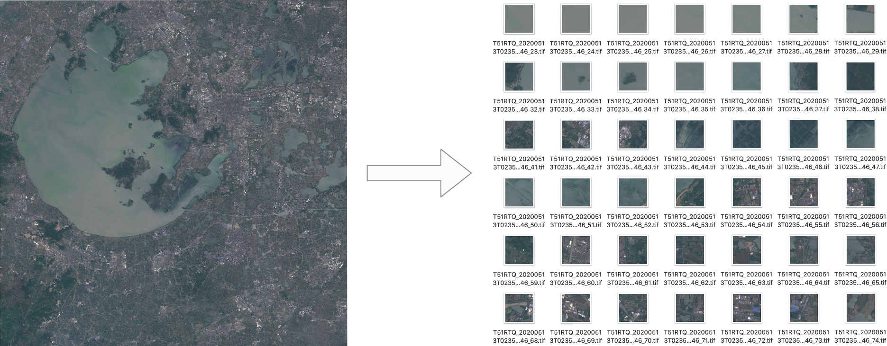

# Image Classification

This is classification turtorial for satellite image. We will use sentinal-2 TCI data as an example. It cover from training data prepare, train the model, and predict the new files.

## Prepare Trainning Data
Suppose we got a scene of sentinel-2 satellite TCI image data. You can download from [esa scihub](https://scihub.copernicus.eu/dhus/#/home). I has got the secene id `T51RTQ_20200513T023551_TCI` and convert the JPEG2000 to GeoTIFF.

1. patch the large 10980x10980 pixel image to 128x128 pixel image

```

    ➜ cd  tests/classification/      
    ➜ ts make-mask-cls --filepath T51RTQ_20200513T023551_TCI.tif --width 128 --height 128 --outpath ./patched
    processing 1/1 file T51RTQ_20200513T023551_TCI.tif ...
    14%|███████████████▉                                                              | 12/85 [00:07<00:45,  1.60it/s]
```
You should get the following data:



2. **labeling the train data and test data**  

You can split the data into tran data and test data as below. And then labeling those patched image into four classes: `water`, `residential`, `farmland`, `forest`. Reorganize the catalog of these small images according to different categories and split them to train and validation dataset.
```
        .
        ├── train
        │    ├── water
        │    │   ├── T51RTQ_20200513T023551_TCI_1_29.tif
        │    │   ├── T51RTQ_20200513T023551_TCI_2_29.tif
        │    │   ├── T51RTQ_20200513T023551_TCI_8_14.tif
        │    │   └── ...
        │    ├── frameland
        │    │   ├── T51RTQ_20200513T023551_TCI_3_2.tif
        │    │   ├── T51RTQ_20200513T023551_TCI_3_77.tif
        │    │   ├── T51RTQ_20200513T023551_TCI_11_1.tif
        │    │   └── ...
        │    ├── residential
        │    │   ├── T51RTQ_20200513T023551_TCI_0_29.tif
        │    │   ├── T51RTQ_20200513T023551_TCI_1_37.tif
        │    │   ├── T51RTQ_20200513T023551_TCI_4_36.tif
        │    │   └── ...
        │    ├── forest
        │    │   ├── T51RTQ_20200513T023551_TCI_7_21.tif
        │    │   ├── T51RTQ_20200513T023551_TCI_22_45.tif
        │    │   ├── T51RTQ_20200513T023551_TCI_41_29.tif
        │    │   └── ...
        ├── validation
        │    ├── water
        │    │   ├── T51RTQ_20200513T023551_TCI_5_32.tif
        │    │   ├── T51RTQ_20200513T023551_TCI_5_12.tif
        │    │   ├── T51RTQ_20200513T023551_TCI_4_32.tif
        │    │   └── ...
        │    ├── frameland
        │    │   ├── T51RTQ_20200513T023551_TCI_9_2.tif
        │    │   ├── T51RTQ_20200513T023551_TCI_6_76.tif
        │    │   ├── T51RTQ_20200513T023551_TCI_2_5.tif
        │    │   └── ...
        │    ├── residential
        │    │   ├── T51RTQ_20200513T023551_TCI_8_29.tif
        │    │   ├── T51RTQ_20200513T023551_TCI_3_37.tif
        │    │   ├── T51RTQ_20200513T023551_TCI_2_36.tif
        │    │   └── ...
        │    ├── forest
        │    │   ├── T51RTQ_20200513T023551_TCI_8_12.tif
        │    │   ├── T51RTQ_20200513T023551_TCI_31_5.tif
        │    │   ├── T51RTQ_20200513T023551_TCI_29_29.tif
        │    │   └── ...
```

## Train the model

test