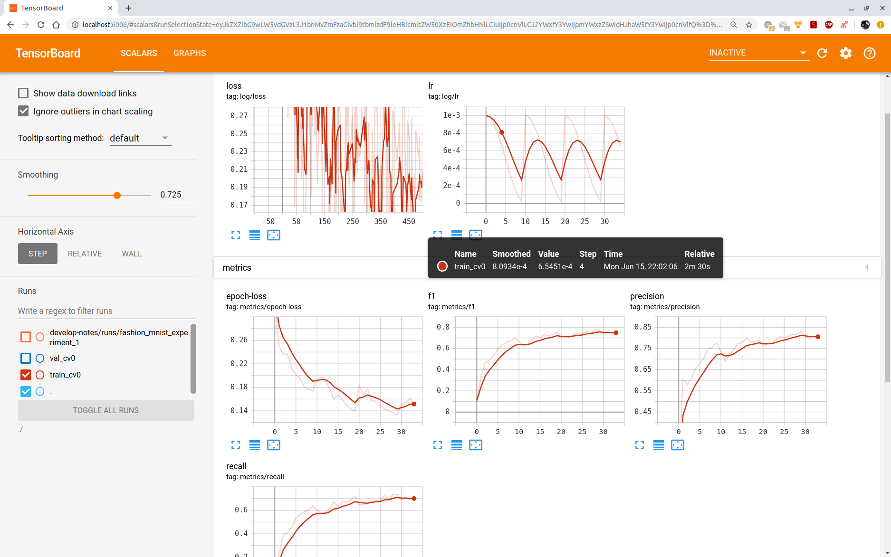

# Semantic Segmentation
This tutorial will teach you how to use torchsat to train your semantic segmentation model for your satellite project.

## Prepare training data
If your training data is a large image (such as 10000 x 10000 pixels), you can use torchsat command-line tool to crop it into small pictures for training. There are two cases:
1. If your sample labels are vectors, then you can use `ts make_mask_seg` to directly generate small samples that can be directly used for training.
2. If your sample label is a picture, then you can use `ts make_mask_cls` to cut the large satellite image and label image separately.


The final generated train data needs to be organized as follows:
```
    .
    ├── train
    │   ├── image
    │   │   ├── train_1.jpg
    │   │   ├── train_2.jpg
    │   │   ├── ...
    │   └── label
    │       ├── train_1.png
    │       ├── train_2.png
    │       ├── ...
    └── val
        ├── image
        │   ├── val_10.jpg
        │   ├── val_11.jpg
        │   ├── ...
        └── label
            ├── val_10.png
            ├── val_11.png
            ├── ...
```

## Training model
You can use scripts/train_seg.py to train your model. 
You can also modify some of them according to your own needs, such as `data augmentation`, `loss function`, `optimzer`, `model`.

```
usage: test.py [-h] [--train-path TRAIN_PATH] [--val-path VAL_PATH]
               [--extensions EXTENSIONS [EXTENSIONS ...]] [--model MODEL]
               [--pretrained PRETRAINED] [--resume PATH]
               [--num-classes NUM_CLASSES] [--in-channels IN_CHANNELS]
               [--device DEVICE] [-b BATCH_SIZE] [--epochs EPOCHS] [--lr LR]
               [--print-freq PRINT_FREQ] [--ckp-dir CKP_DIR]

TorchSat Segmentation Training Script

optional arguments:
  -h, --help            show this help message and exit
  --train-path TRAIN_PATH
                        train dataset path
  --val-path VAL_PATH   validate dataset path
  --extensions EXTENSIONS [EXTENSIONS ...]
                        the train image extension
  --model MODEL         model name. default, unet34
  --pretrained PRETRAINED
                        use ImageNet pretrained params
  --resume PATH         path to latest checkpoint (default: none)
  --num-classes NUM_CLASSES
                        num of classes
  --in-channels IN_CHANNELS
                        input image channels
  --device DEVICE       device
  -b BATCH_SIZE, --batch-size BATCH_SIZE
                        batch size
  --epochs EPOCHS       epochs
  --lr LR               initial learning rate
  --print-freq PRINT_FREQ
                        print frequency
  --ckp-dir CKP_DIR     path to save checkpoint

```

You can also open Tensorboard to view the loss and test accuracy during training.


Currently supported models are:
- UNet
    - ResNet Backbone: `unet_restnet18`, `unet_resnet34`, `unet_resnet101`

## Inference new image
[TODO]